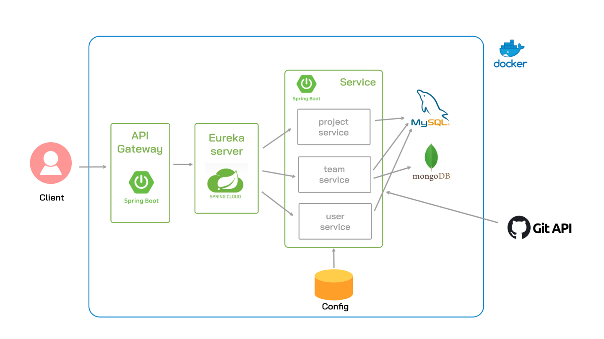
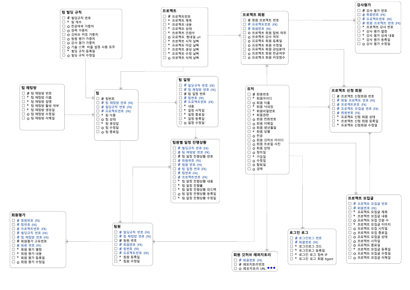
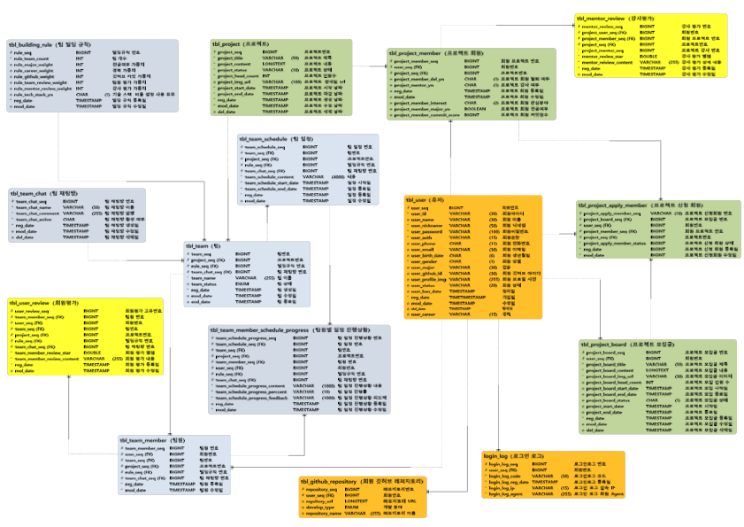

# TEAM-BUILDING
한화시스템 BEYOND SW부트캠프 Spring 프로젝트

<table>
 <tr>
    <td align="center"><a href="https://github.com/kookong2"></a></td>
    <td align="center"><a href="https://github.com/beanteacher"></a></td>
    <td align="center"><a href="https://github.com/person76"></a></td>
    <td align="center"><a href="https://github.com/SANGHYUN0519"></a></td>
    <td align="center"><a href="https://github.com/AYeong-Jeon"></a></td>
  </tr>
  <tr>
    <td align="center"><a href=https://github.com/kookong2><b>kookong2</b></a></td>
    <td align="center"><a href="https://github.com/beanteacher"><b>beanteacher</b></a></td>
    <td align="center"><a href="https://github.com/person76"><b>person76</b></a></td>
    <td align="center"><a href="https://github.com/SANGHYUN0519"><b>SANGHYUN0519</b></a></td>
    <td align="center"><a href="https://github.com/AYeong-Jeon"><b>AYeong-Jeon</b></a></td>
  </tr>
</table>

<br>

## 💻프로젝트 소개

현대의 조직은 성공을 위해 뛰어난 개인보다 협력과 소통이 잘 이루어지는 팀을 더 필요로 합니다. 팀 빌딩 솔루션은 조직의 구성원들이 함께 일하며 더 나은 성과를 낼 수 있도록 돕는 맞춤형 팀 빌딩 프로그램을 제공합니다.
팀 빌딩 기능은 사용자가 원하는 팀의 조건과 이용자의 정보를 활용한 알고리즘을 통해 효율적이고 생산적인 팀을 구축합니다.

<br> <br>

## 📰프로젝트 필요성

팀 프로젝트는 조직이 직면하는 여러 도전과 문제를 해결하는 데 중요한 역할을 합니다. 조직 내에서 원활하지 않은 소통은 종종 오해와 갈등을 일으켜 업무 효율을 떨어뜨릴 수 있습니다. 팀 빌딩 알고리즘을 활용하여 구성원들의 레벨을 조절해 구성원들이 서로의 강점과 약점을 이해하고 협력할 수 있는 분위기를 조성하도록 합니다. 이를 통해 팀은 더욱 긴밀하게 협력하고 효과적으로 문제를 해결할 수 있습니다.

또한, 팀 빌딩 기능은 다양한 문제 해결 상황을 통해 팀원들이 협력적으로 창의적인 해결책을 모색하는 데 기여합니다. 서로 다른 경험과 배경을 가진 팀원들로 구성해 아이디어를 결합함으로써 더 나은 결과를 만들어내고, 이는 조직 내 문제 해결 과정에서 필수적인 역량으로 작용합니다.

결과적으로 팀 빌딩 프로젝트는 팀워크 강화, 소통 개선, 리더십 발달, 문제 해결 능력 향상 등 여러 측면에서 조직의 성과를 높이는 데 필수적입니다. 성공적인 팀 빌딩은 조직이 목표를 달성하는 것은 물론, 장기적인 성장 기반을 마련하는 데도 중요한 역할을 합니다.


<br/>

## 📅개발 환경

<table>
<tr>
    <td>언어</td>
    <td> 
    </td>
  </tr>
  <tr>
    <td>DB</td>
    <td>
      
          
</td>
  </tr>
  <tr>
    <td>프레임워크</td>
    <td>
</td>
  </tr>
<tr>
    <td>기타</td>
    <td>
        
        
        

</td>
  </tr>
</table>

<br/>

## 📄물리모델링


<br/>

## 📄논리모델링


<br/>

## 📄MSA 시스템 아키텍쳐



<br />

## 📍주요기능

- 회원
  - 프로젝트 참여 신청
  - 팀원 개인 스케줄 설정
  - 팀 채팅
  - 팀원 평가
- 관리자 (프로젝트)
  - 프로젝트 모집글 게시
  - 프로젝트 생성 및 관리
- 관리자 (팀)
  - 자동 팀 빌딩 (팀 빌딩 알고리즘)
  - 팀 관리
  - 멘토 평가

<br/>

## 📄 명세서

|     이름      |                                                문제 링크                                                 |
|:-----------:|:----------------------------------------------------------------------------------------------------:|
| DDD 이벤트 스토밍 | https://miro.com/app/board/uXjVKj5617c=/     |
|  요구사항 정의서   | https://docs.google.com/spreadsheets/d/1Kob6x7Rv2ZG7byc1e_eQpFn5DlWBgOLOvefKpXc0SUU/edit?gid=0#gid=0 |
| 테스트 결과 보고서  |   https://www.notion.so/Swagger-114e5998dfd780ea9030dcd704e33f40?pvs=4     |

<br/>


## 📌프로젝트 규칙

* 필드(카멜표기법) - 명사로 명명, 도메인 + 필드명
  ex) User클래스 userId, userName

* 메소드(카멜표기법) - 동사로 명명, 메소드명으로 기능 파악 가능하게 작성
  ex) 회원가입 joinUser

* 클래스명(파스칼표기법) - 도메인명, 도메인명+(controller, service, repository …)
  ex) UserController

* 엔드포인트 - api/v1 으로 시작

* 단어 선택은 각자 정하고 필요 시 수정

* xml 파일 위치 resources/mapper/기능/기능.xml

* 패키지명 service, dto, controller, entity, mapper

* SQL 작성 : *은 사용하지 않는다.

* SELECT, JOIN, WHERE같이 예약어는 대문자로, 나머진 소문자 작성

<br/>

## ⚠️ 권장  commit 컨벤션

```
git commit -m "[FEAT] Spring Security 추가"
```
`FEAT` : 새로운 기능 추가 <br>
`BUG` : 버그 수정 <br>
`DOCS` : 문서 수정 <br>
`REFACTOR` : 코드 리팩토링 <br>
`TEST` : 테스트 코드, 리팩토링 테스트 코드 추가 <br>
`CHORE` : 빌드 업무 수정, 패키지 매니저 수정, 자잘한 수정 <br>

<br/>

---


<br/>


